# 1. ERD
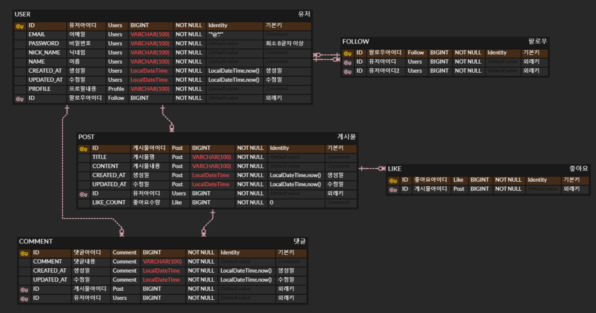

# 2. 테스트 커버리지 50% 달성
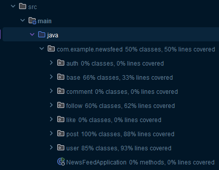

# 3. 프로젝트 요약 정리
뉴스피드 프로젝트를 복습하였다. 
회원, 좋아요, 팔로우, 게시물, 댓글 기능을 구현했다. 
기초프로젝트를 진행하면서, 연관관계와 CRUD에 대해서 정확하게 파악하고, 익숙하도록 복습하였다. 

# 4. POSTMAN 실행사진
## 1. 회원가입
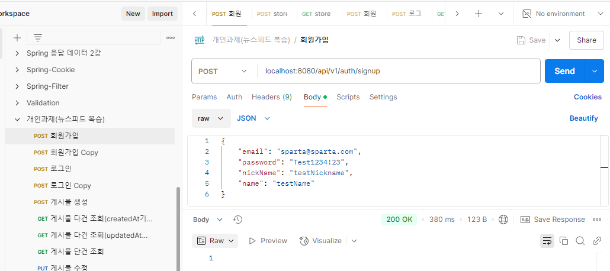

## 2. 로그인
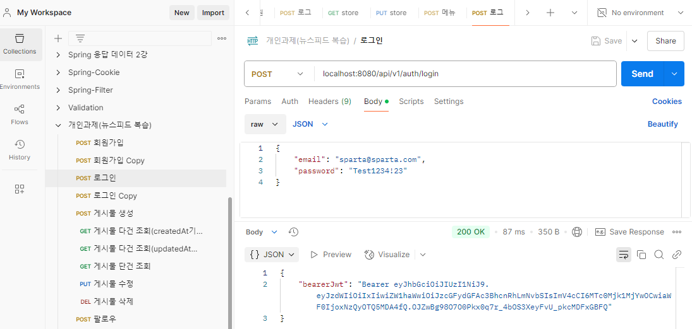

## 3. 비밀번호 수정
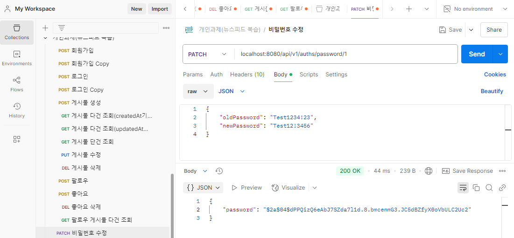

## 4. 게시물 생성
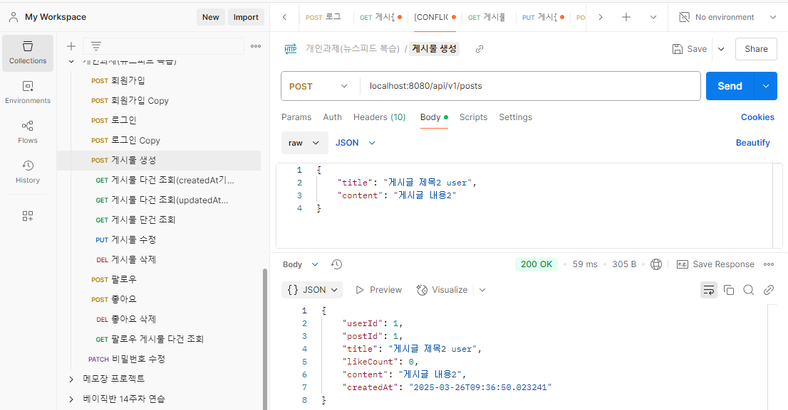

## 5. 게시물 다건 조회(createdAt기준)
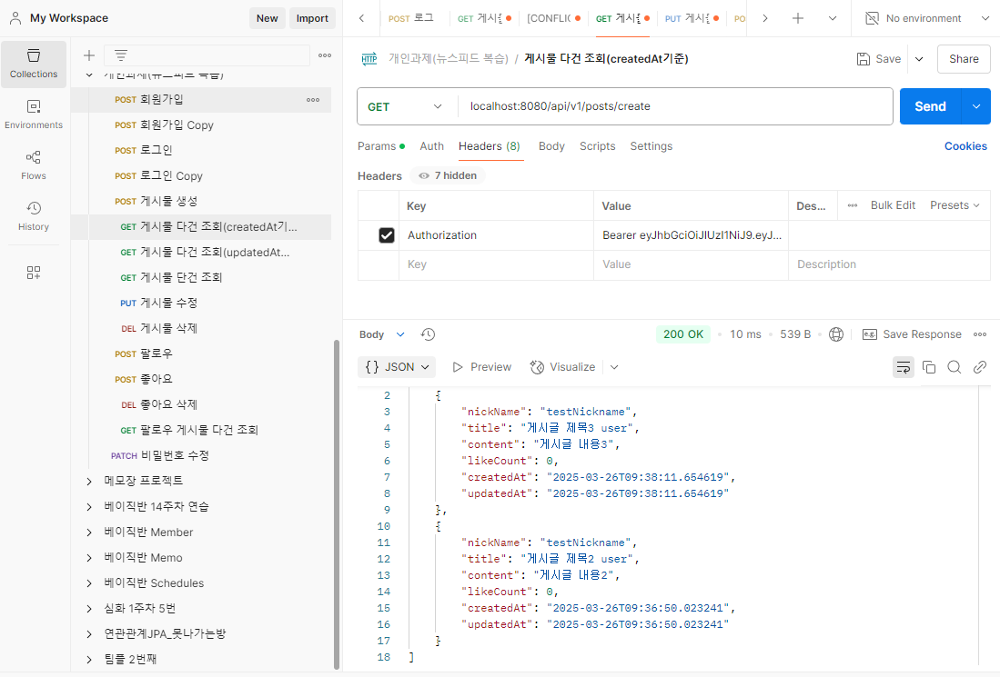

## 6. 게시물 다건 조회(updatedAt기준)
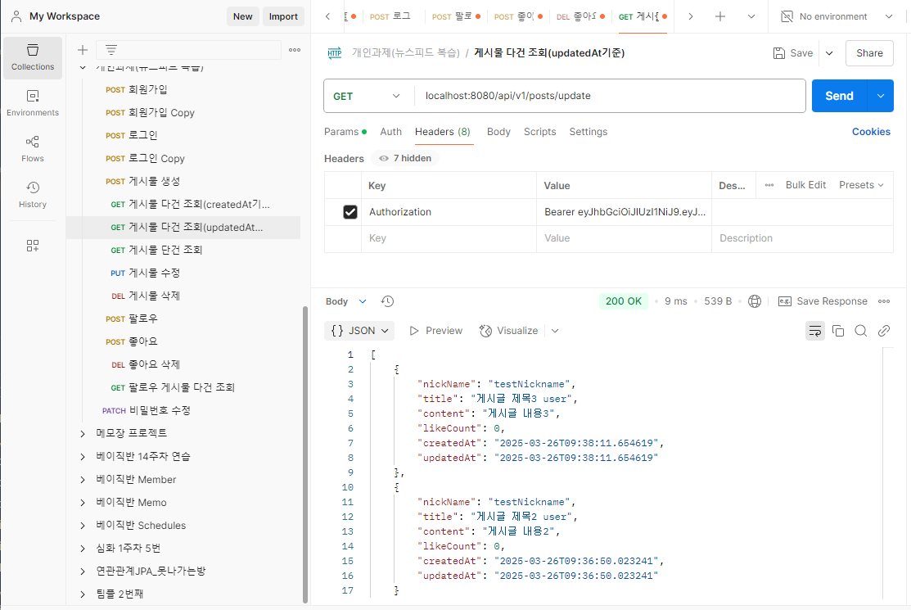

## 7. 게시물 단건 조회(updatedAt기준)
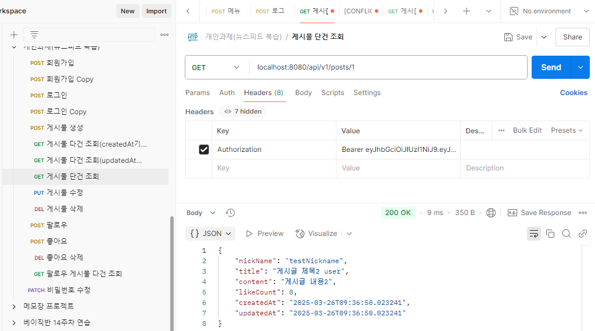

## 8. 게시물 수정
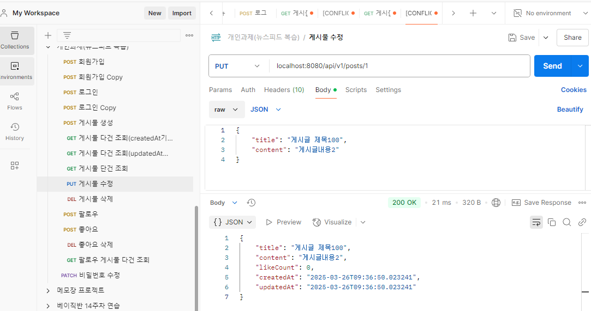

## 9. 게시물 삭제
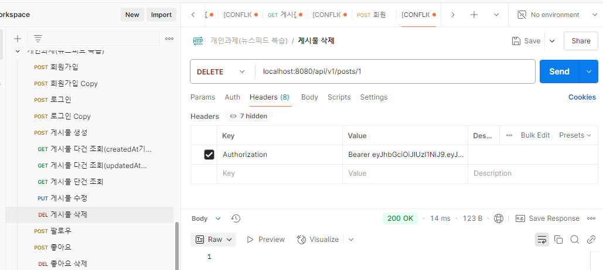

## 10. 팔로우
testNickname이 testNickname2에게 팔로우.
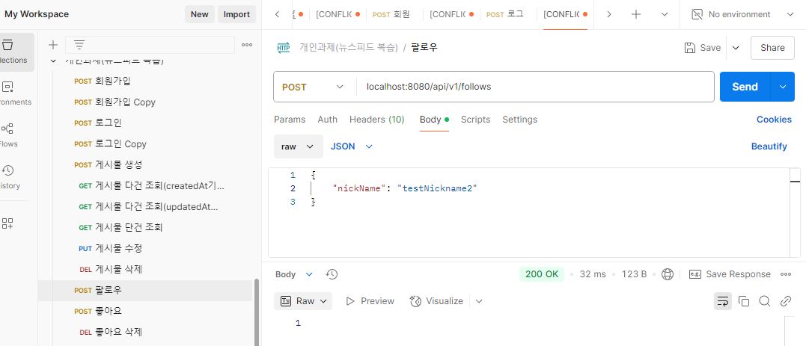

## 11. 좋아요
연속으로 좋아요를 해도, 한번만 됨.
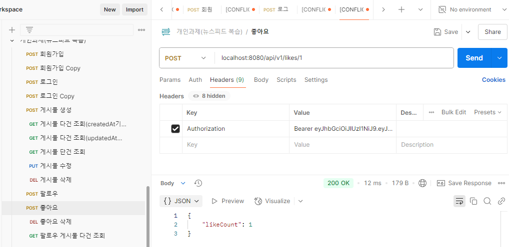

## 12. 좋아요 삭제
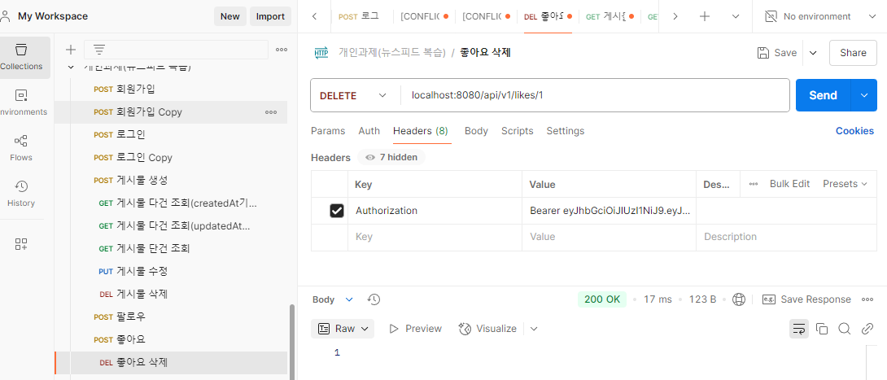

## 13. 팔로우 게시물 다건 조회
testNickname이 testNickname2에게 팔로우하고 나서,
testNickname이 팔로우한 사람들의 게시물을 조회.
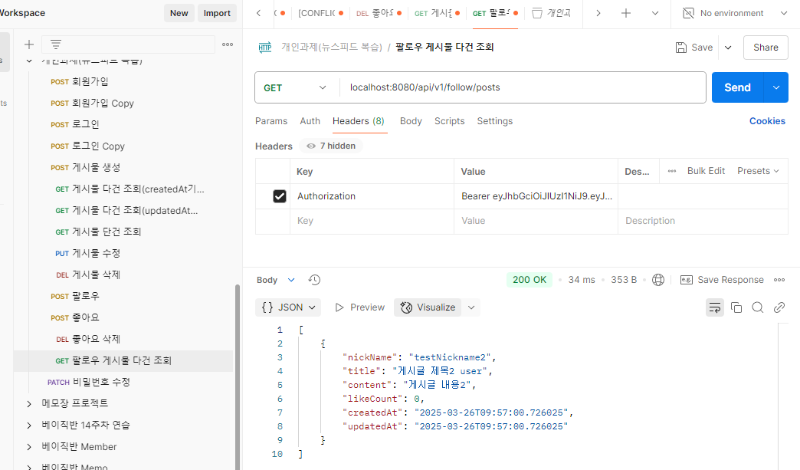

## 14. 댓글 등록

## 15. 댓글 다건 조회
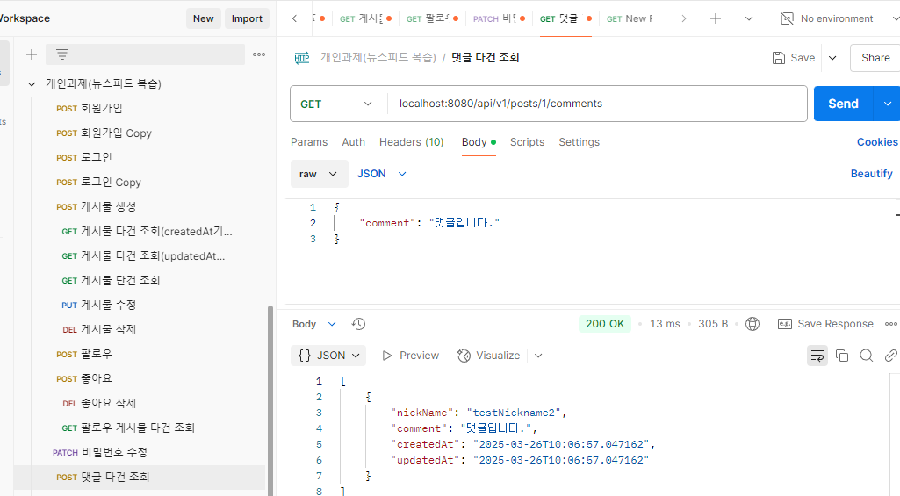

## 16. 댓글 단건 조회
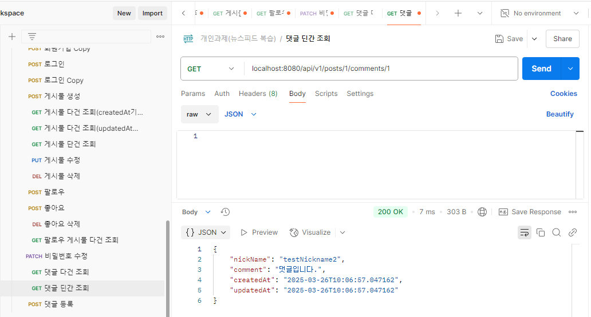

## 17. 댓글 수정
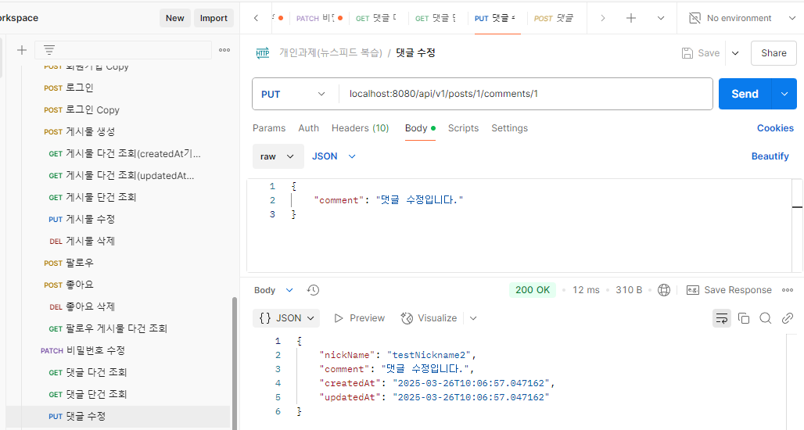

## 18. 댓글 삭제
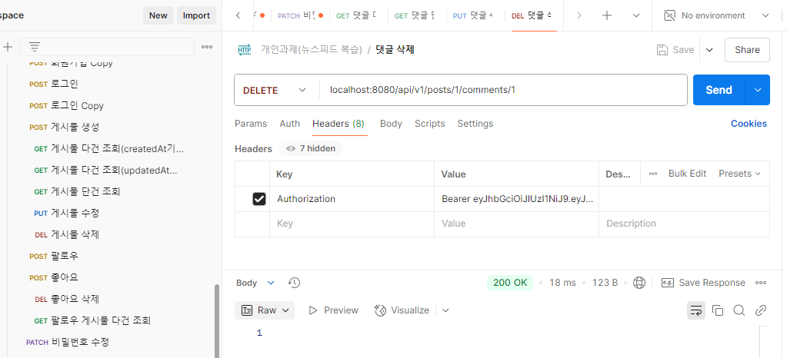

